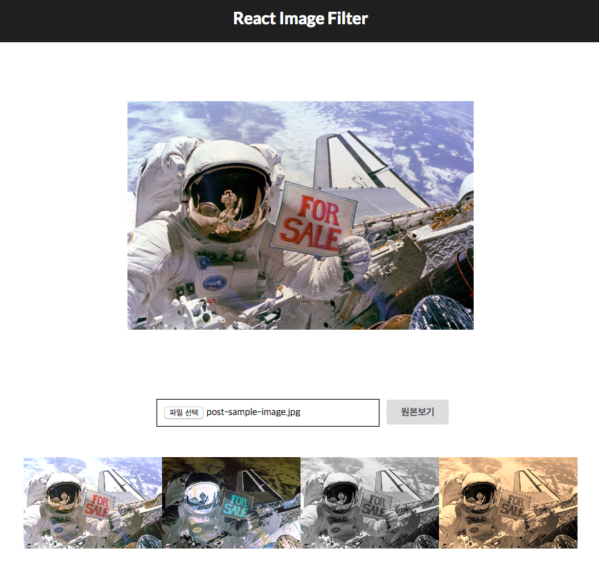

# React-Image-Filter-App

## stack
- create-react-app
- semantic-ui-react

## how to use?
```
git clone https://github.com/isme2n/react-image-filter-app.git {dir-name}
cd {dir-name}
npm install
npm start
```
## sample


